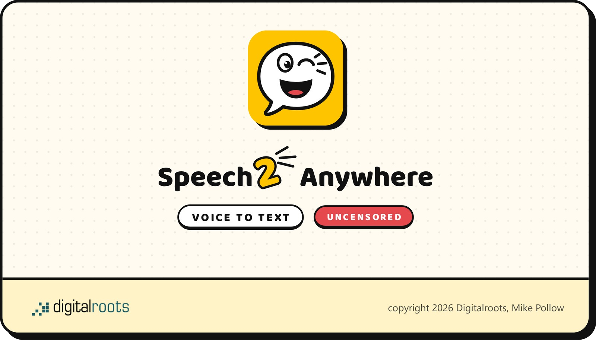

<p align="center"></p>

# Speech2Anywhere

**Hold a key, speak, release. Polished text appears at the cursor.**

Speech2Anywhere is a push-to-talk voice-to-text app that runs entirely on your own machine. Whisper turns speech into text, a local language model fixes punctuation, fillers and register for the app you are typing into. No cloud, no account, no subscription.

[](https://github.com/MikeGT4/speech2anywhere/releases/latest)


## Two builds, one idea

| | Windows 11 (this repository) | macOS (separate build, not in this repository) |
|---|---|---|
| Hotkey | hold **F8**, **F9** for AI edit commands | hold **fn** (Globe key) |
| Speech to text | faster-whisper, `large-v3` on CUDA | mlx-whisper, `whisper-large-v3-turbo` on the Apple GPU |
| Text cleanup | Ollama, `gemma4:12b`, uncensored model optional | Ollama, `huihui_ai/qwen3-abliterated:8b` (uncensored) |
| Hardware | NVIDIA GPU with 12 GB VRAM or more | Apple Silicon (M1 or newer), 16 GB unified memory |
| Install | installer on the [Releases page](https://github.com/MikeGT4/speech2anywhere/releases/latest) | not published here |

## What it does

- **Push to talk.** Hold F8, speak, release. A 250 ms pre-roll buffer catches the first word even if you start speaking before the keyboard hook fires.
- **Context-aware cleanup.** Speech2Anywhere detects the active app (Mail, Slack, Terminal, VS Code, Cursor, Obsidian and more) and rewrites in the right register. The model stays warm for 24 hours, so the first F8 after boot has the same latency as the hundredth.
- **Edit by voice on F9.** Select text, hold F9, say what to change.
- **German and English**, detected automatically per dictation.
- **Uncensored option.** The settings dialog offers an abliterated Qwen model as cleanup model. It is not tuned to refuse or lecture; it only cleans up what you said.
- **Audio and text stay on your PC.** Speech2Anywhere talks to Ollama on `127.0.0.1`. It goes online only for the update check against the GitHub Releases API (at start, every six hours by default, on request; the automatic checks can be switched off), for an update download you confirm, and for loading models from Hugging Face and the Ollama registry. The bundled Ollama app checks for its own updates.
- **Live indicator at the cursor, seven styles.** The default is a comic speech bubble with a chattering mascot: while you speak, fragments of your recognized words fly out of its mouth (a switch in the settings turns them off), and while it thinks, a washing drum, an iron or turning gears keep it busy; a phosphor oscilloscope, Gun Barrel, target lock, voiceprint, terminal and the classic look can be picked in the settings. While you speak it warns about clipping (too close) and a dead microphone (no signal). The mascot in the tray icon chatters while recording, an orange-red dot marks errors.
- **Survives a missing microphone.** If the configured input device is not connected at start, Speech2Anywhere comes up anyway; pressing F8 turns the tray icon yellow for 3 seconds instead of crashing.
- **Crash diagnostics.** `faulthandler`, threading exception hook, Qt message handler and a 60 second heartbeat all flow into `speech2anywhere.log`.

## Requirements

- Windows 11 (Windows 10 should work, untested)
- NVIDIA GPU with 12 GB VRAM or more (RTX 4080 or 5080 and up recommended)
- 25 GB of free disk space: the installer is about 3.5 GB, the first-run wizard pulls roughly 10 GB of models into `%USERPROFILE%\models\` and `%USERPROFILE%\.ollama\`
- A stable internet connection for the first start (one-time model download)

## Install (end users)

Download everything from the [latest release](https://github.com/MikeGT4/speech2anywhere/releases/latest) into the same folder: `Kira-Setup-vX.Y.Z.exe`, the `.bin` parts (`-1.bin`, `-2.bin`) and `SHA256SUMS.txt`. The setup is split into parts, so the `.bin` files must sit next to the `.exe`.

1. Double-click `Kira-Setup-vX.Y.Z.exe`.
2. If Windows Defender SmartScreen warns: "More info", then "Run anyway". Speech2Anywhere is not code-signed. Verify the download with `certutil -hashfile Kira-Setup-vX.Y.Z.exe SHA256` against `SHA256SUMS.txt` if you want to be sure.
3. Click through the setup wizard.
4. On first start a second wizard downloads the models (Whisper large-v3 from Hugging Face, `gemma4:12b` via Ollama). One time only; dictation works offline afterwards.
5. Speech2Anywhere starts in the tray with a yellow framed logo. **Hold F8, speak, release.**

### Installation (Deutsch)

Alle Dateien der [neuesten Release](https://github.com/MikeGT4/speech2anywhere/releases/latest) in denselben Ordner laden: `Kira-Setup-vX.Y.Z.exe`, die `.bin`-Teile und `SHA256SUMS.txt`. Die `.bin`-Teile müssen neben der `.exe` liegen. Doppelklick auf die `.exe`, bei der SmartScreen-Warnung „Weitere Informationen" und „Trotzdem ausführen" (Speech2Anywhere ist nicht signiert). Beim ersten Start lädt ein zweiter Assistent die Modelle, danach funktioniert das Diktieren ohne Internet. Speech2Anywhere erscheint in der Taskleiste: **F8 halten, sprechen, loslassen.**

## Install (developers)

Requirements: Python 3.12 on Windows (`py -3.12 --version`), an NVIDIA driver with CUDA (`nvidia-smi` works), `uv` (`py -3.12 -m pip install uv`), [Ollama for Windows](https://ollama.com/download) (`winget install Ollama.Ollama`) and Git.

```powershell
git clone https://github.com/MikeGT4/speech2anywhere.git C:\Users\<user>\dev\kira
cd C:\Users\<user>\dev\kira
.\scripts\install_win.ps1
ollama pull gemma4:12b
.\scripts\install_autostart.ps1
```

`install_win.ps1` creates `%USERPROFILE%\kira-venv`, installs faster-whisper, pystray and PyQt6 and embeds the branded icon into `kira.exe`. It does not write a config file: copy `installer\config.yaml.template` to `%APPDATA%\Kira\config.yaml`, otherwise Speech2Anywhere falls back to the small built-in default model instead of `gemma4:12b`. The scripts default `-Source` to the repo containing them; pass `-Source <path>` to install from a different checkout. Run manually with `C:\Users\<user>\kira-venv\Scripts\kira.exe`.

`pip install` regenerates the entry-point wrappers without resource info, so the EXE icon falls back to the generic Python icon after every reinstall. Re-embed it with `powershell -ExecutionPolicy Bypass -File scripts\embed_icon.ps1`. If you change the logo (`assets/brand/speech2anywhere-logo-1024.png`), regenerate the icons first with `py -3.12 scripts\regenerate_branded_icon.py`.

## Configuration

`%APPDATA%\Kira\config.yaml`. Tray, "Einstellungen" opens a form for the common settings: microphone gain and device, language, cleanup model, hotkey.

`audio.input_device` is a substring match: `'USB Microphone'` matches `Mikrofon (2- USB Microphone)`. If the configured device is not enumerated, Speech2Anywhere logs a `WARNING kira.recorder` line listing every input device it did see.

**Pin your physical microphone even if Windows shows it as the default.** On machines with an ASUS Intelligo or "AI Noise-Canceling Microphone" filter, the Windows default can flip to that virtual device for a moment, for example while a USB microphone is still enumerating after a cold boot, and the filter kills speech as noise. Symptom in `speech2anywhere.log`: `Recorder.stop: ... peak=0.0002 rms=0.0001`, then Whisper hallucinating "Vielen Dank.", then no text. Pinning bypasses the filter. If the USB device is not ready when you press the hotkey, you get a 3 second yellow tray icon instead of a silent dictation.

### Fast mode

Settings, cleanup model: the checkbox **fast mode** switches to `gemma4:e4b`. Use it when the 12B model keeps sliding into CPU offload (`ollama ps` shows a `49/51 CPU/GPU` split). The small model is pulled once when you enable it. Standard cleanup (punctuation, fillers) stays practically identical, F9 edit commands get noticeably weaker. Off by default.

### Learning from corrections

Since v0.4.0 Speech2Anywhere keeps a local dictation history (`%LOCALAPPDATA%\Kira\history`, deleted after three months) and compares it every 30 minutes with the messages you actually sent. If you fixed a misrecognised word before sending, Speech2Anywhere records the pair. A pair seen in two dictations applies on its own; single cases wait under tray, **Gelernte Wörter**, until you accept them. Rejected pairs are never learned again.

The messages come from JSONL chat histories in the folders listed under `learning.sources` (one message per line, sent messages marked `"type": "user"`). Without sources Speech2Anywhere only writes the history; `learning.enabled: false` turns both off. Everything stays on your machine.

Learned pairs go three ways: unusual words join Whisper's vocabulary prompt, misrecognitions that are not real words become fixed replacements (whole words only), and misrecognitions that are real words only reach the cleanup model as a hint, because only the sentence tells which one was meant.

## Troubleshooting

| Symptom | Fix |
|---|---|
| Tray icon never appears | Check `%LOCALAPPDATA%\Kira\speech2anywhere.log` for boot errors; native crashes land in `%LOCALAPPDATA%\Kira\speech2anywhere-faulthandler.log`. |
| F8 does nothing visible | Watch `speech2anywhere.log`: every press logs either `Recorder.stop` (success) or `WARNING kira.app: Hotkey press but input device unavailable` (microphone missing). The tray icon turns yellow for 3 seconds in the second case. If your tray icons are auto-hidden, pin Speech2Anywhere's icon. |
| `faster-whisper` cuDNN error | `py -3.12 -m uv pip install --python C:\Users\<user>\kira-venv\Scripts\python.exe --force-reinstall nvidia-cudnn-cu12` |
| "Ollama unreachable" toast | `curl http://127.0.0.1:11434/api/tags` from PowerShell. If it fails, restart `ollama app.exe` from `%LOCALAPPDATA%\Programs\Ollama\` or reinstall via `winget install Ollama.Ollama`. Use `127.0.0.1`, not `localhost`: Windows 11 24H2 and later resolve localhost to IPv6, Ollama binds IPv4. |
| Cleanup never runs, `speech2anywhere.log` shows `Styler failed (Failed to connect to Ollama)` while Ollama is up | Check `OLLAMA_HOST` in your user environment. `0.0.0.0:11434` lets other machines reach Ollama but is no valid target for a client. Since v0.4.0 Speech2Anywhere connects to `127.0.0.1` in that case and shows a tray notice after three failed attempts in a row. |
| Cleanup takes 5 to 15 seconds instead of staying near-instant | `ollama ps` shows the model as `100% CPU`. Known Ollama-on-Windows issue: the GPU discovery probe can time out at model load. Fix: disable hardware-accelerated GPU scheduling under Settings, System, Display, Graphics, add a Windows Defender exclusion for the Ollama processes (`ollama.exe`, `ollama app.exe`, `ollama_llama_server.exe`), update Ollama, reboot. |
| The "cleanup on CPU" toast names WSL or Docker as port owner | Since v0.3.3 Speech2Anywhere checks who holds port 11434. If `wslrelay.exe` or a Docker process holds it, an Ollama from WSL2 or a container answers and the Windows Ollama never gets the port. Stop the foreign Ollama or move it to another port (Docker Compose: `"127.0.0.1:11435:11434"`); the Windows tray app retries the bind and takes over. |
| Text lands in the wrong window | The foreground window at release time is the target. Do not Alt+Tab while recording. |
| An admin-elevated app does not react to F8 | The keyboard hook cannot see events in elevated windows unless Speech2Anywhere itself runs elevated. Known trade-off. |

## License

Personal use. See [`LICENSE`](LICENSE) (English and German). Commercial use needs written consent.

The German word list `assets/wordlist-de.txt` is derived from [wordfreq](https://github.com/rspeer/wordfreq) data, licensed under [CC BY-SA 4.0](https://creativecommons.org/licenses/by-sa/4.0/).

Made by [Digitalroots](https://www.digitalroots.de), Mike Pollow.
